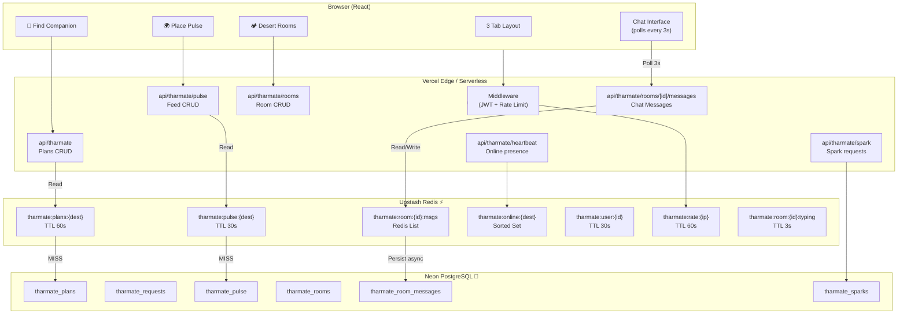

# TharMate v2 — System Design (Production-Grade)

> **Status**: Design Phase → Ready for Implementation
> **Platform**: CamelThar (Next.js 14 + Vercel + Neon PostgreSQL + Upstash Redis)
> **Last Updated**: March 5, 2026

---

## 🎯 Three Core Features

| Tab | Feature | Real-time? | Auth Required |
|-----|---------|-----------|---------------|
| 🤝 **Find Companion** | Browse/post plans, send "Spark" | No — cached feeds | Yes (to post/spark) |
| 🌍 **Place Pulse** | Live city feed (tips, photos, alerts) | Yes — 30s polling | Yes (to post) |
| 🏕️ **Desert Rooms** | Ephemeral 1:1 chat | Yes — Redis polling | Yes (always) |

---

## 🚨 Critical: Why NOT Socket.IO

> [!WARNING]
> **You're deployed on Vercel (serverless).** Socket.IO requires a persistent server process.
> Vercel functions are stateless — they spin up, execute, and die.
> Socket.IO **cannot run on Vercel**.

### Options Evaluated

| Tech | Works on Vercel? | Cost | Verdict |
|------|-----------------|------|---------|
| **Socket.IO** | ❌ No (needs persistent server) | Needs separate server (Railway/Render) | **Too complex** |
| **Pusher** | ✅ Yes (hosted WebSocket) | Free tier: 200k msgs/day | Good but adds dependency |
| **Ably** | ✅ Yes | Free tier: 6M msgs/month | Similar to Pusher |
| **Upstash Redis + Polling** | ✅ Yes (already have it!) | Free tier: 10k commands/day | **Best for our scale** |
| **Server-Sent Events (SSE)** | ✅ Yes (Edge Runtime) | Free (built into Next.js) | **Best for Pulse feed** |

### ✅ Our Architecture

```
Real-time Chat (Desert Rooms) → Upstash Redis (fast polling every 3s)
Live Pulse Feed              → Redis-backed cache + manual refresh
Online Presence              → Redis Sorted Set (heartbeat)
Plan Feed Caching            → Redis with 60s TTL
```

> [!TIP]
> This gives us near-real-time performance using what you ALREADY have (Upstash Redis).
> Zero extra services. Zero extra cost. Zero extra deployment complexity.

---

## 🏗️ Architecture



---

## ⚡ How Real-time Works (Without WebSockets)

### Chat (Desert Rooms) — Redis-First Architecture

```
User A sends message:
  1. POST /api/tharmate/rooms/[id]/messages
  2. → Validate: user is room creator or partner
  3. → Write to Redis List: RPUSH tharmate:room:{id}:msgs {message}
  4. → Async: Write to PostgreSQL (for persistence)
  5. → Return success immediately

User B polls for messages:
  1. GET /api/tharmate/rooms/[id]/messages?after={lastMsgId}
  2. → Read from Redis List: LRANGE tharmate:room:{id}:msgs -50 -1
  3. → Filter messages after lastMsgId cursor
  4. → Return new messages (< 50ms response time!)

Polling interval: 3s when chat is open, pause when tab hidden
```

> [!IMPORTANT]
> Messages are stored in **Redis first** (instant) and **PostgreSQL second** (durable).
> This means chat feels real-time (< 50ms) while still having permanent storage.

### Typing Indicator — Lightweight Redis TTL Trick

```
User A starts typing:
  1. POST /api/tharmate/rooms/[id]/typing
  2. → SET tharmate:room:{id}:typing:{userId} 1 EX 3

User B sees indicator on next poll:
  1. GET /api/tharmate/rooms/[id]/messages also checks typing key
  2. → EXISTS tharmate:room:{id}:typing:{partnerId}
  3. → If key exists → show "typing..." (key auto-expires after 3s of silence)
```

### Online Presence — Redis Sorted Sets

```
Every 25 seconds, client calls:
  POST /api/tharmate/heartbeat
  → ZADD tharmate:online:{destination} {timestamp} {userId}

To get "X travelers online":
  → ZRANGEBYSCORE tharmate:online:{dest} {now-30s} {now}
  → Returns count of users active in last 30 seconds
```

### Plan Feed Caching

```
GET /api/tharmate?destination=jaisalmer
  1. Check Redis: GET tharmate:plans:jaisalmer
  2. HIT → Return cached (< 5ms)
  3. MISS → Query PostgreSQL → Cache result with 60s TTL

Cache invalidation:
  When a new plan is created → DEL tharmate:plans:{destination}
  (Only bust the relevant destination, not all caches)
```

---

## 🔐 Security & Auth

### Middleware (All Protected Routes)

```typescript
// middleware.ts — runs at Edge before every API call
export async function middleware(req: NextRequest) {
  const token = req.cookies.get('session')?.value
  if (!token) return NextResponse.json({ error: 'Unauthorized' }, { status: 401 })

  const user = await verifyJWT(token)
  if (!user) return NextResponse.json({ error: 'Invalid token' }, { status: 401 })

  // Inject user into headers for downstream routes
  const headers = new Headers(req.headers)
  headers.set('x-user-id', user.id)
  return NextResponse.next({ request: { headers } })
}

export const config = {
  matcher: ['/api/tharmate/:path*']
}
```

### Rate Limiting — Redis Counter Pattern

```typescript
// lib/rate-limit.ts
export async function rateLimit(identifier: string, limit = 30, windowSecs = 60) {
  const key = `tharmate:rate:${identifier}`
  const count = await redis.incr(key)
  if (count === 1) await redis.expire(key, windowSecs)
  if (count > limit) throw new Error('Rate limit exceeded')
}

// Usage per route:
// POST plan/spark  → 10 req/min (anti-spam)
// GET feed         → 60 req/min (generous for polling)
// POST message     → 30 req/min (chat)
// POST heartbeat   → 5 req/min (very lightweight)
```

### Input Validation — Zod Schemas

```typescript
// lib/validators/tharmate.ts
import { z } from 'zod'

export const CreatePlanSchema = z.object({
  destination: z.string().min(2).max(100).trim(),
  travel_dates: z.string().min(3).max(100),
  description: z.string().min(10).max(500).trim(),
  looking_for: z.string().min(5).max(200).trim(),
  max_companions: z.number().int().min(1).max(10),
})

export const PulseMessageSchema = z.object({
  destination: z.string().min(2).max(100).trim(),
  message: z.string().min(3).max(300).trim(),
  tag: z.enum(['tip', 'photo', 'question', 'alert', 'joinme']),
  photo_url: z.string().url().optional(),
})

export const ChatMessageSchema = z.object({
  message: z.string().min(1).max(1000).trim(),
})
```

### Room Authorization Guard

```typescript
// Before any room action, verify membership:
async function assertRoomMember(roomId: string, userId: string) {
  const room = await getRoomById(roomId)
  if (!room) throw new Error('Room not found')
  if (room.creator_id !== userId && room.partner_id !== userId) {
    throw new Error('Not a member of this room')
  }
  if (room.status !== 'active') throw new Error('Room is expired or closed')
  return room
}
```

---

## 🤝 Spark System (Companion Requests)

### How "Send Spark" Works

```
User A sees User B's plan and sends a Spark:
  1. POST /api/tharmate/spark { planId, message }
  2. → Check: has A already sparked this plan? (prevent duplicates)
  3. → INSERT into tharmate_sparks
  4. → Notify User B (via Redis list: tharmate:notifications:{userId})

User B checks their sparks:
  1. GET /api/tharmate/spark?received=true
  2. → Returns pending sparks with sender profile

User B accepts / declines:
  PATCH /api/tharmate/spark/{sparkId} { action: 'accept' | 'decline' }
  
  On accept:
  → Create Desert Room linking both users + the plan
  → Update spark status = 'accepted'
  → Notify User A their spark was accepted
  
  On decline:
  → Update spark status = 'declined' (soft delete)
```

### Spark State Machine

```
[pending] → [accepted] → (Desert Room created)
          → [declined]
          → [expired]  (if plan passes travel date)
```

---

## 📊 Database Schema

### Existing Tables ✅
- `tharmate_plans` — Travel plans
- `tharmate_requests` — Join requests

### New Tables 🆕

#### `tharmate_sparks` — Companion Spark Requests

```sql
CREATE TABLE IF NOT EXISTS tharmate_sparks (
    id UUID DEFAULT gen_random_uuid() PRIMARY KEY,
    plan_id UUID NOT NULL REFERENCES tharmate_plans(id) ON DELETE CASCADE,
    sender_id UUID NOT NULL REFERENCES users(id) ON DELETE CASCADE,
    receiver_id UUID NOT NULL REFERENCES users(id) ON DELETE CASCADE,
    message TEXT,
    status TEXT NOT NULL DEFAULT 'pending'
        CHECK (status IN ('pending', 'accepted', 'declined', 'expired')),
    created_at TIMESTAMPTZ DEFAULT NOW(),
    responded_at TIMESTAMPTZ,

    UNIQUE (plan_id, sender_id)  -- Prevent duplicate sparks per plan
);

CREATE INDEX idx_sparks_receiver ON tharmate_sparks(receiver_id, status);
CREATE INDEX idx_sparks_sender ON tharmate_sparks(sender_id);
```

#### `tharmate_pulse` — Place Pulse Feed

```sql
CREATE TABLE IF NOT EXISTS tharmate_pulse (
    id UUID DEFAULT gen_random_uuid() PRIMARY KEY,
    user_id UUID NOT NULL REFERENCES users(id) ON DELETE CASCADE,
    destination TEXT NOT NULL,
    message TEXT NOT NULL,
    tag TEXT NOT NULL DEFAULT 'tip'
        CHECK (tag IN ('tip', 'photo', 'question', 'alert', 'joinme')),
    photo_url TEXT,
    helpful_count INT DEFAULT 0,
    is_active BOOLEAN DEFAULT true,
    created_at TIMESTAMPTZ DEFAULT NOW()
);

CREATE INDEX idx_pulse_dest_time ON tharmate_pulse(destination, created_at DESC);
CREATE INDEX idx_pulse_user ON tharmate_pulse(user_id);
```

#### `tharmate_rooms` — Desert Rooms

```sql
CREATE TABLE IF NOT EXISTS tharmate_rooms (
    id UUID DEFAULT gen_random_uuid() PRIMARY KEY,
    creator_id UUID NOT NULL REFERENCES users(id) ON DELETE CASCADE,
    partner_id UUID REFERENCES users(id),
    room_type TEXT NOT NULL DEFAULT 'desert_room'
        CHECK (room_type IN ('quick_connect', 'desert_room', 'caravan')),
    destination TEXT NOT NULL,
    plan_id UUID REFERENCES tharmate_plans(id) ON DELETE SET NULL,
    spark_id UUID REFERENCES tharmate_sparks(id) ON DELETE SET NULL,
    title TEXT,
    expires_at TIMESTAMPTZ NOT NULL,
    status TEXT NOT NULL DEFAULT 'active'
        CHECK (status IN ('active', 'expired', 'closed')),
    created_at TIMESTAMPTZ DEFAULT NOW()
);

CREATE INDEX idx_rooms_users ON tharmate_rooms(creator_id, partner_id);
CREATE INDEX idx_rooms_status ON tharmate_rooms(status, expires_at);
```

#### `tharmate_room_messages` — Chat Messages (Durable Store)

```sql
CREATE TABLE IF NOT EXISTS tharmate_room_messages (
    id UUID DEFAULT gen_random_uuid() PRIMARY KEY,
    room_id UUID NOT NULL REFERENCES tharmate_rooms(id) ON DELETE CASCADE,
    sender_id UUID NOT NULL REFERENCES users(id) ON DELETE CASCADE,
    message TEXT NOT NULL,
    message_type TEXT NOT NULL DEFAULT 'text'
        CHECK (message_type IN ('text', 'system', 'image')),
    created_at TIMESTAMPTZ DEFAULT NOW()
);

CREATE INDEX idx_room_msgs ON tharmate_room_messages(room_id, created_at);
```

---

## 🔑 Redis Key Design

| Key Pattern | Type | TTL | Purpose |
|-------------|------|-----|---------|
| `tharmate:plans:{dest}` | STRING (JSON) | 60s | Cached plan listings |
| `tharmate:pulse:{dest}` | STRING (JSON) | 30s | Cached pulse feed |
| `tharmate:room:{roomId}:msgs` | LIST | Until room expires | Chat messages (fast read) |
| `tharmate:room:{roomId}:typing:{userId}` | STRING | 3s | Per-user typing indicator |
| `tharmate:online:{dest}` | SORTED SET | auto-trim | Online presence per city |
| `tharmate:user:{userId}:heartbeat` | STRING | 30s | User still active |
| `tharmate:rate:{ip}:{route}` | STRING | 60s | Rate limiting counter |
| `tharmate:notifications:{userId}` | LIST | 7 days | Pending spark notifications |
| `tharmate:room:{roomId}:lock` | STRING | 5s | Prevent duplicate room creation |

---

## 🛡️ Resilience & Fallback Strategy

> Redis being down should never break the app — only slow it down.

```typescript
// lib/redis-tharmate.ts — Safe wrapper pattern
export async function getCachedPlans(destination: string) {
  try {
    const cached = await redis.get(`tharmate:plans:${destination}`)
    if (cached) return JSON.parse(cached)
  } catch (e) {
    console.error('[Redis] Cache read failed, falling back to DB', e)
    // ↓ Fall through to DB query — app still works
  }
  
  const plans = await getPlansFromDB(destination)
  
  try {
    await redis.set(`tharmate:plans:${destination}`, JSON.stringify(plans), { ex: 60 })
  } catch (e) {
    console.error('[Redis] Cache write failed, continuing without cache', e)
    // Non-fatal — data still returned from DB
  }
  
  return plans
}
```

### What Happens When Redis Is Down

| Feature | Redis Down Behavior |
|---------|-------------------|
| Plan Feed | Falls back to direct DB query (~300ms, not 10ms) |
| Pulse Feed | Falls back to direct DB query (~250ms) |
| Chat | Falls back to DB reads/writes (slower but works) |
| Online Count | Returns 0 gracefully |
| Rate Limiting | Fails open (allow traffic through) |
| Typing Indicator | Hidden (non-critical) |

---

## 🧹 Room Expiry & Data Cleanup

### Lazy Expiry (Recommended for Vercel)

```typescript
// On every room fetch, check if expired and update lazily
async function getRoomWithExpiryCheck(roomId: string) {
  const room = await getRoomById(roomId)
  
  if (room.expires_at < new Date() && room.status === 'active') {
    // Lazy expire: update status on first access after expiry
    await db.execute(
      'UPDATE tharmate_rooms SET status = $1 WHERE id = $2',
      ['expired', roomId]
    )
    // Clean up Redis messages
    await redis.del(`tharmate:room:${roomId}:msgs`)
    return { ...room, status: 'expired' }
  }
  
  return room
}
```

### Room Duration Options

| Room Type | Default Duration | Use Case |
|-----------|-----------------|---------|
| `quick_connect` | 24 hours | Brief intro / vibe check |
| `desert_room` | 7 days | Planning a specific trip together |
| `caravan` | 30 days | Extended journey coordination |

### Memory Capsule (After Room Expires)

```
When room expires:
  1. Snapshot last 20 messages → store as tharmate_room_messages (already there)
  2. Mark room status = 'expired'
  3. Delete Redis list (messages safely in PostgreSQL)
  4. Surface as "Memory Capsule" in UI — read-only nostalgia view
```

---

## 🌐 API Contract

### Key Endpoints

#### `POST /api/tharmate` — Create Plan

```json
// Request
{
  "destination": "Jaisalmer",
  "travel_dates": "March 15–22, 2026",
  "description": "Looking for a camel trek buddy...",
  "looking_for": "Solo traveler, adventurous",
  "max_companions": 1
}

// Response 201
{
  "id": "uuid",
  "destination": "Jaisalmer",
  "user": { "id": "...", "name": "Rahul", "avatar_url": "..." },
  "created_at": "2026-03-05T10:00:00Z"
}
```

#### `GET /api/tharmate/rooms/[roomId]/messages`

```json
// Request params: ?after=<lastMessageId>&limit=50

// Response 200
{
  "messages": [
    {
      "id": "uuid",
      "sender_id": "uuid",
      "message": "Hey! Excited to plan this trip",
      "message_type": "text",
      "created_at": "2026-03-05T10:05:00Z"
    }
  ],
  "partner_typing": false,
  "room_expires_in_seconds": 518400
}
```

#### `POST /api/tharmate/spark` — Send a Spark

```json
// Request
{ "plan_id": "uuid", "message": "Hey, I'm also heading to Jaisalmer!" }

// Response 201
{ "spark_id": "uuid", "status": "pending" }

// Error: Already sparked
// Response 409
{ "error": "You've already sent a Spark for this plan" }
```

---

## 📁 File Structure

```
app/tharmate/
├── page.tsx                           ← SEO + Server Component           ✅ EXISTS
├── TharMateClient.tsx                 ← Shell with 3 tabs               🔄 REWRITE
└── components/
    ├── FindCompanionTab.tsx           ← Tab 1: Plan cards               🆕
    ├── CompanionCard.tsx              ← Plan card (dark desert design)  🔄 REPLACE
    ├── CreatePlanForm.tsx             ← Create plan modal               🔄 REDESIGN
    ├── SparkButton.tsx                ← Send spark + status indicator   🆕
    ├── PlacePulseTab.tsx              ← Tab 2: Live feed                🆕
    ├── PulseScoreCard.tsx             ← City vibe score widget          🆕
    ├── PulseMessage.tsx               ← Single feed message             🆕
    ├── DesertRoomsTab.tsx             ← Tab 3: Rooms list               🆕
    ├── ChatRoom.tsx                   ← Chat interface + polling        🆕
    ├── TypingIndicator.tsx            ← Animated typing dots            🆕
    ├── RoomCountdown.tsx              ← Expiry timer                    🆕
    └── MemoryCapsule.tsx              ← Past room summaries             🆕

app/api/tharmate/
├── route.ts                           ← Plans CRUD (with Redis cache)   🔄 ADD CACHING
├── join/route.ts                      ← Join requests                   ✅ EXISTS
├── spark/route.ts                     ← Spark CRUD                      🆕
├── pulse/route.ts                     ← Pulse feed CRUD                 🆕
├── heartbeat/route.ts                 ← Online presence                 🆕
└── rooms/
    ├── route.ts                       ← Room CRUD                       🆕
    └── [roomId]/
        ├── route.ts                   ← Single room (+ lazy expiry)     🆕
        ├── typing/route.ts            ← Typing indicator                🆕
        └── messages/route.ts         ← Chat messages (Redis-first)     🆕

lib/
├── redis.ts                           ← Redis client                    ✅ EXISTS
├── redis-tharmate.ts                  ← TharMate-specific Redis ops     🆕
├── rate-limit.ts                      ← Rate limiting helper            🆕
└── db/queries/
    ├── tharmate.ts                    ← Plan queries                    ✅ EXISTS
    ├── tharmate-pulse.ts              ← Pulse queries                   🆕
    ├── tharmate-sparks.ts             ← Spark queries                   🆕
    └── tharmate-rooms.ts             ← Room + msg queries              🆕

lib/validators/
└── tharmate.ts                        ← Zod schemas for all inputs      🆕

database_scripts/
├── add-tharmate.sql                   ← v1 schema                      ✅ EXISTS
└── add-tharmate-v2.sql               ← Sparks + Pulse + Rooms schema   🆕

middleware.ts                          ← JWT auth + rate limit (Edge)   🔄 ADD ROUTES
```

---

## 📊 Performance Targets

| Operation | Without Redis | With Redis | Notes |
|-----------|--------------|------------|-------|
| Load plan feed | ~300ms | **< 10ms** | Cache hit |
| Load pulse feed | ~250ms | **< 10ms** | Cache hit |
| Send chat message | ~200ms | **< 50ms** | Redis write |
| Get new messages | ~200ms | **< 30ms** | Redis list |
| Online count | ~150ms | **< 5ms** | Sorted set |
| Auth check (JWT) | ~40ms | **~5ms** | Edge Runtime |
| Rate limit check | ~40ms | **~3ms** | Redis incr |

---

## 🔄 Implementation Phases

### Phase 1: Foundation + Redesign (Find Companion)
1. Create `app/tharmate/components/` folder structure
2. Build `TharMateClient.tsx` with 3-tab dark desert layout
3. Redesign `CompanionCard.tsx` (dark theme, avatar, verified, "Send Spark")
4. Redesign `CreatePlanForm.tsx` with Zod validation
5. Add `lib/redis-tharmate.ts` with Redis caching for plan feed
6. Add `lib/rate-limit.ts` and wire into middleware
7. Heartbeat API + "X travelers online" counter
8. **New:** Build `SparkButton.tsx` + `api/tharmate/spark/route.ts`
9. **New:** `tharmate_sparks` SQL migration

### Phase 2: Place Pulse
1. SQL migration for `tharmate_pulse` table
2. Build `lib/db/queries/tharmate-pulse.ts` with Zod validation
3. Build `api/tharmate/pulse/route.ts` with rate limiting
4. Build `PlacePulseTab.tsx` + `PulseMessage.tsx` + `PulseScoreCard.tsx`
5. Add Redis caching for pulse feed (30s TTL)

### Phase 3: Desert Rooms
1. SQL migration for `tharmate_rooms` + `tharmate_room_messages`
2. Build `lib/db/queries/tharmate-rooms.ts`
3. Build all `api/tharmate/rooms/` routes with auth guards
4. Build `ChatRoom.tsx` with 3s polling + pause-on-hidden-tab
5. Build `TypingIndicator.tsx` + `RoomCountdown.tsx`
6. Room expiry lazy check + Memory Capsules
7. Spark → Room creation flow (accept spark = create room)

---

## ⚠️ Edge Cases to Handle

| Scenario | Handling |
|----------|---------|
| User sparks own plan | Block at API: `sender_id !== receiver_id` check |
| Room partner leaves app mid-chat | Messages queue in Redis, delivered on next poll |
| Redis list grows unbounded | `LTRIM tharmate:room:{id}:msgs 0 199` after every write (keep last 200) |
| Two users accept spark simultaneously | Redis `SET tharmate:room:{id}:lock 1 NX EX 5` lock prevents double room |
| User polls expired room | Lazy expiry returns `status: 'expired'` — client stops polling |
| Pulse photo_url is malicious | URL must pass `new URL()` parse + only allow known CDN domains |
| Heartbeat floods API | Rate limited to 5 req/min per user |
| Message with XSS content | Sanitize with `DOMPurify` on render (never trust stored HTML) |

---

## 🔍 Observability & Monitoring

### Key Metrics to Track (Vercel Analytics + Custom)

```typescript
// Add to sensitive paths for debugging:
console.log(JSON.stringify({
  event: 'cache_miss',
  key: `tharmate:plans:${destination}`,
  latency_ms: Date.now() - start,
  user_id: userId,
}))
```

| Metric | Alert Threshold | Tool |
|--------|----------------|------|
| Cache hit rate < 70% | Investigate TTL strategy | Upstash console |
| API p95 latency > 500ms | Check DB query plans | Vercel Functions |
| Redis commands > 8k/day | Approaching free tier limit | Upstash console |
| Room messages > 200 (trim check) | Redis memory growth | Custom log |
| 401 rate spike | Possible auth bug | Vercel logs |

---

## 🌱 Environment Variables Checklist

```bash
# Already have ✅
DATABASE_URL=           # Neon PostgreSQL
UPSTASH_REDIS_REST_URL= # Upstash Redis
UPSTASH_REDIS_REST_TOKEN=

# Need to add 🆕
JWT_SECRET=             # For verifying session tokens
NEXT_PUBLIC_APP_URL=    # For building absolute URLs
```

---

## 🚀 Ready to Implement?

> [!IMPORTANT]
> **Recommended order**: Phase 1 → Phase 2 → Phase 3
>
> Phase 1 alone gives you:
> - Beautiful desert-themed redesign
> - Spark system (send + accept companion requests)
> - Redis-cached plan feed (10x faster loads)
> - "247 travelers online" counter
> - Rate limiting + input validation foundation
> - Foundation for Phase 2 & 3

> [!TIP]
> **Quick wins in Phase 1** — `SparkButton.tsx` and the Spark API can be built in a single afternoon.
> It's the highest-impact visible feature: users can actually *act* on a companion listing.
